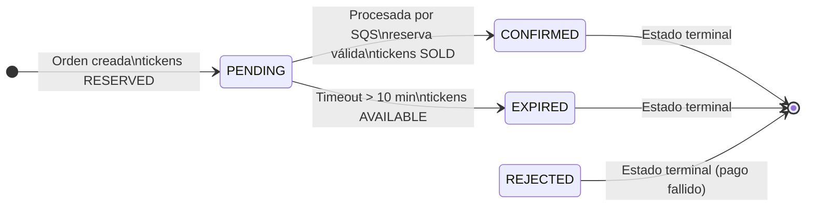
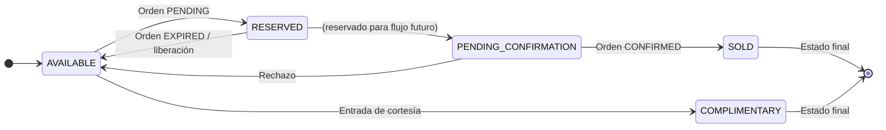
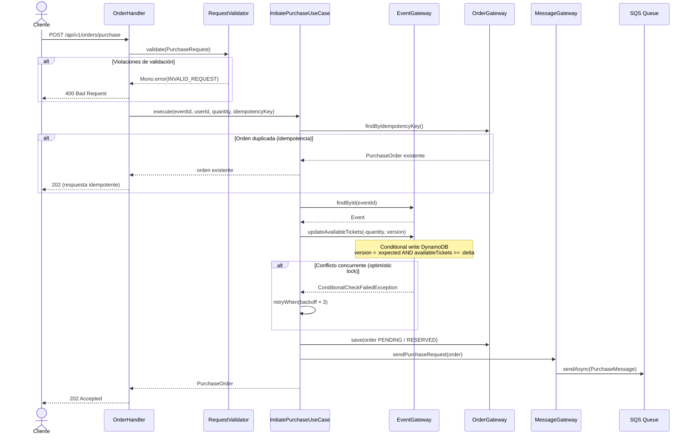
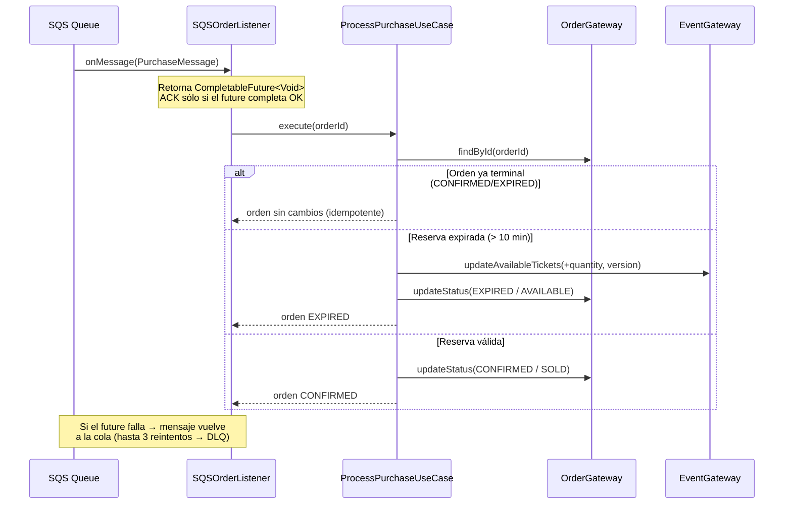

# Ticket Platform MS

Microservicio reactivo de venta de tickets construido con **Spring Boot 4.x + WebFlux**, diseñado bajo **Clean Architecture**. Gestiona la reserva, procesamiento asíncrono y confirmación de órdenes de compra con garantías de consistencia frente a concurrencia.

---

## Tabla de Contenido

- [Descripción General](#descripción-general)
- [Módulos del Proyecto](#módulos-del-proyecto)
- [Modelos de Dominio](#modelos-de-dominio)
- [Flujo de Compra](#flujo-de-compra)
- [Patrones de Diseño Aplicados](#patrones-de-diseño-aplicados)
- [Seguridad y Resiliencia](#seguridad-y-resiliencia)
- [API Reference](#api-reference)
- [Configuración](#configuración)
- [Ejecución Local](#ejecución-local)
- [Infraestructura](#infraestructura)

---

## Descripción General

El servicio es un sistema de backend reactivo de alto rendimiento que permite:
- Crear y consultar eventos con capacidad limitada de tickets.
- Reservar atómicamente disponibilidad (máximo 10 min) para evitar sobreventa.
- Procesar compras de forma asíncrona delegando el procesamiento pesado a consumidores SQS.
- Garantizar consistencia e integridad mediante mecanismos de concurrencia no bloqueantes.
- Proteger el sistema contra abuso de recursos y reintentos maliciosos.

---

## Módulos del Proyecto

| Módulo | Capa | Responsabilidad |
|--------|------|-----------------|
| `model` | Dominio | Entidades, enums, puertos (interfaces gateway), excepciones de negocio |
| `usecase` | Dominio | Casos de uso: orquestación de lógica de negocio |
| `dynamodb-repository` | Infraestructura | Adaptador DynamoDB con locking optimista y consultas por índices GSI |
| `sqs-publisher` | Infraestructura | Publica mensajes SQS de forma reactiva (`Mono.fromFuture`) |
| `reactive-web` | Infraestructura | API REST WebFlux: routers funcionales, handlers, filtros, validación |
| `sqs-listener` | Infraestructura | Consume la cola SQS con ACK asíncrono via `CompletableFuture` |
| `app-service` | Aplicación | Bootstrap, configuración Spring, scheduler de limpieza |

---

## Modelos de Dominio

### Ciclo de vida de una Orden y sus Tickets



### Máquina de Estado — TicketStatus



> En el flujo actual, la transición `RESERVED → SOLD` se produce directamente al confirmar la orden. `PENDING_CONFIRMATION` está modelado para flujos de pago externo futuro.

### Relación OrderStatus ↔ TicketStatus

| OrderStatus | TicketStatus derivado |
|-------------|----------------------|
| `PENDING` | `RESERVED` |
| `PROCESSING` | `PENDING_CONFIRMATION` |
| `CONFIRMED` | `SOLD` |
| `REJECTED` | `AVAILABLE` |
| `EXPIRED` | `AVAILABLE` |

El `TicketStatus` se **deriva automáticamente** al cambiar el `OrderStatus` en `PurchaseOrder.withStatus()`. Nunca se asigna manualmente.

---

## Flujo de Compra

### Fase 1 — Reserva (síncrona, HTTP)



### Fase 2 — Confirmación (asíncrona, SQS)



---

## Patrones de Diseño Aplicados

1. **Puertos y Adaptadores**: Desacoplamiento total del núcleo de negocio de las tecnologías de persistencia y mensajería.
2. **Factory Method**: Métodos estáticos en modelos de dominio (ej. `Event.create()`) para asegurar objetos válidos desde su nacimiento.
3. **Data Mapper**: Separación entre los modelos de dominio (`PurchaseOrder`) y las entidades de persistencia (`OrderEntity`).
4. **Idempotencia**: Un patrón crítico para sistemas distribuidos que asegura que una operación no se ejecute más de una vez ante reintentos.
5. **Optimistic Locking**: Manejo de versiones para permitir alta concurrencia sin bloqueos de filas en base de datos.

---

## Seguridad y Resiliencia

El sistema implementa capas de protección:

### 1. Protección contra Abuso (Rate Limiting)
- **Filtro Reactivo**: Implementación de `RateLimiterFilter` que limita las peticiones por IP del cliente, mitigando ataques de fuerza bruta y abuso de recursos.

### 2. Protección contra Reintentos Maliciosos
- **Idempotencia Estricta**: El uso de `idempotencyKey` garantiza que solicitudes duplicadas no generen lógica de negocio extra ni afecten el inventario.

### 3. Consistencia y Prevención de Sobreventa
- **Escrituras Condicionales**: DynamoDB valida atómicamente la disponibilidad y la versión del registro antes de confirmar un descuento de inventario.
- **Fail-Fast Validation**: Las solicitudes inválidas son rechazadas en el `Entry Point` (Handlers), protegiendo la infraestructura interna (SQS/DB).

---

## API Reference

### Eventos

#### Crear evento
```http
POST /api/v1/events
Content-Type: application/json

{
  "name": "Rock en Rio 2026",
  "date": "2026-09-15T20:00:00Z",
  "venue": "Estadio Nacional",
  "totalCapacity": 50000
}
```
**Response `201 Created`:**
```json
{
  "id": "uuid",
  "name": "Rock en Rio 2026",
  "date": "2026-09-15T20:00:00Z",
  "venue": "Estadio Nacional",
  "totalCapacity": 50000,
  "availableTickets": 50000
}
```

#### Listar todos los eventos
```http
GET /api/v1/events
```

#### Consultar disponibilidad
```http
GET /api/v1/events/{id}/availability
```

---

### Órdenes

#### Iniciar compra
```http
POST /api/v1/orders/purchase
Content-Type: application/json

{
  "eventId": "uuid-del-evento",
  "userId": "user-123",
  "quantity": 2,
  "idempotencyKey": "client-unique-key-abc"
}
```
**Response `202 Accepted`:**
```json
{
  "orderId": "uuid",
  "eventId": "uuid-del-evento",
  "userId": "user-123",
  "quantity": 2,
  "orderStatus": "PENDING",
  "ticketStatus": "RESERVED",
  "createdAt": "2026-03-14T10:00:00Z",
  "updatedAt": "2026-03-14T10:00:00Z"
}
```

**Validaciones:**
| Campo | Regla |
|-------|-------|
| `eventId` | Requerido, no vacío |
| `userId` | Requerido, no vacío |
| `quantity` | Entre 1 y 10 |
| `idempotencyKey` | Requerido, no vacío |

#### Consultar estado de orden
```http
GET /api/v1/orders/{id}
```

---

### Respuestas de Error

```json
{
  "code": "ERR_008",
  "message": "Invalid request: quantity: must be less than or equal to 10"
}
```

| Código | HTTP | Descripción |
|--------|------|-------------|
| `ERR_001` | 404 | Evento no encontrado |
| `ERR_002` | 404 | Orden no encontrada |
| `ERR_003` | 409 | Tickets insuficientes |
| `ERR_007` | 400 | Cantidad supera el máximo permitido |
| `ERR_008` | 400 | Solicitud inválida (validación) |
| `ERR_009` | 409 | Conflicto de concurrencia (reintentar) |
| `ERR_RATE_LIMIT` | 429 | Rate limit excedido |

### Actuator (Health & Metrics)
```http
GET /actuator/health
GET /actuator/metrics
GET /actuator/info
```

---

## Configuración

| Variable de Entorno | Default | Descripción |
|--------------------|---------|-------------|
| `DYNAMODB_ENDPOINT` | `http://localhost:8000` | Endpoint DynamoDB |
| `SQS_ENDPOINT` | `http://localhost:4566` | Endpoint SQS (LocalStack) |
| `SQS_PURCHASE_QUEUE` | `purchase-orders-queue` | Nombre de la cola de compras |
| `AWS_REGION` | `us-east-1` | Región AWS |
| `AWS_ACCESS_KEY` | `local` | Access key (sustituir por IAM role en producción) |
| `AWS_SECRET_KEY` | `local` | Secret key (sustituir por IAM role en producción) |
| `RESERVATION_TIMEOUT_MINUTES` | `10` | Minutos antes de expirar una reserva |
| `RESERVATION_CLEANUP_RATE_MS` | `60000` | Frecuencia del scheduler de limpieza (ms) |
| `RATE_LIMIT_REQUESTS_PER_MINUTE` | `5` | Máx. peticiones/minuto por IP |

---

## Ejecución Local

### Prerequisitos
- Docker + Docker Compose
- Java 25
- Gradle (o usar el wrapper `./gradlew`)

### Guía de Instalación Paso a Paso

1. **Clonar el repositorio**:
   ```bash
   git clone <url-del-repo>
   cd ticket_platform_MS
   ```

2. **Configurar el entorno**: (Opcional) Ajustar el archivo `application.yaml` o exportar variables de entorno si se desean cambiar los puertos o tiempos por defecto.

3. **Levantar infraestructura y aplicación con Docker**:
   ```bash
   docker-compose up --build
   ```
   *Este comando compila el código, genera la imagen Docker y levanta LocalStack (SQS) y DynamoDB Local en red.*

4. **Verificar inicialización**:
   La aplicación espera automáticamente a que DynamoDB y SQS estén listos antes de aceptar peticiones. Puedes monitorear los logs con `docker-compose logs -f app`.

### Verificar que todo esté funcionando
```bash
# Health check
curl http://localhost:8080/actuator/health

# Crear un evento de prueba
curl -X POST http://localhost:8080/api/v1/events \
  -H "Content-Type: application/json" \
  -d '{"name":"Test Event","date":"2027-01-01T20:00:00Z","venue":"Arena","totalCapacity":100}'

# Iniciar una compra
curl -X POST http://localhost:8080/api/v1/orders/purchase \
  -H "Content-Type: application/json" \
  -d '{"eventId":"<id-del-evento>","userId":"user-1","quantity":2,"idempotencyKey":"key-001"}'
```

### Build sin Docker
```bash
./gradlew build
./gradlew :app-service:bootRun
```

---

## Infraestructura

Ver el diagrama de infraestructura detallado en [`docs/architecture.drawio`](docs/architecture.drawio).

Abrir con:
- **VS Code**: extensión [Draw.io Integration]

El archivo contiene dos páginas:
1. **Entorno Local** — servicios Docker y conexiones
2. **Producción AWS** — arquitectura objetivo con ECS, DynamoDB, SQS y Parameter Store
